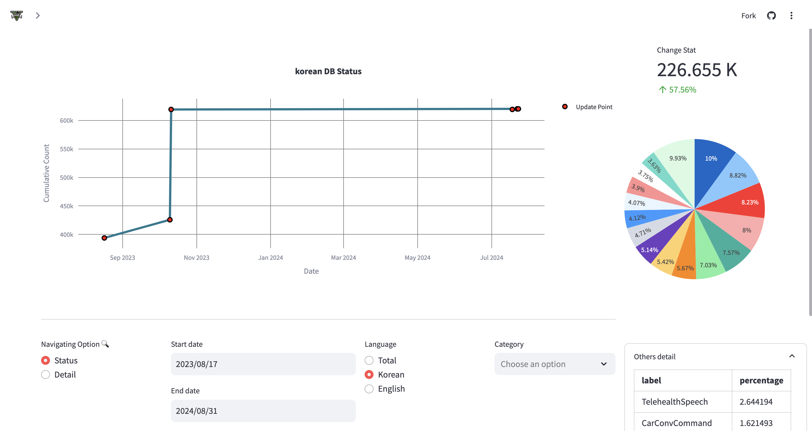
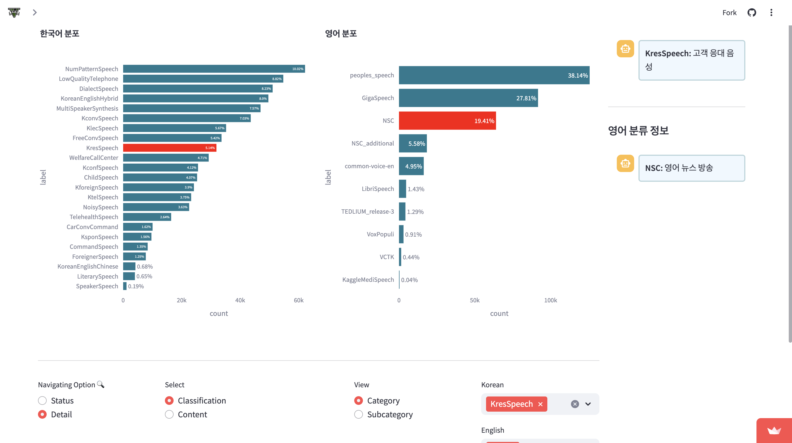
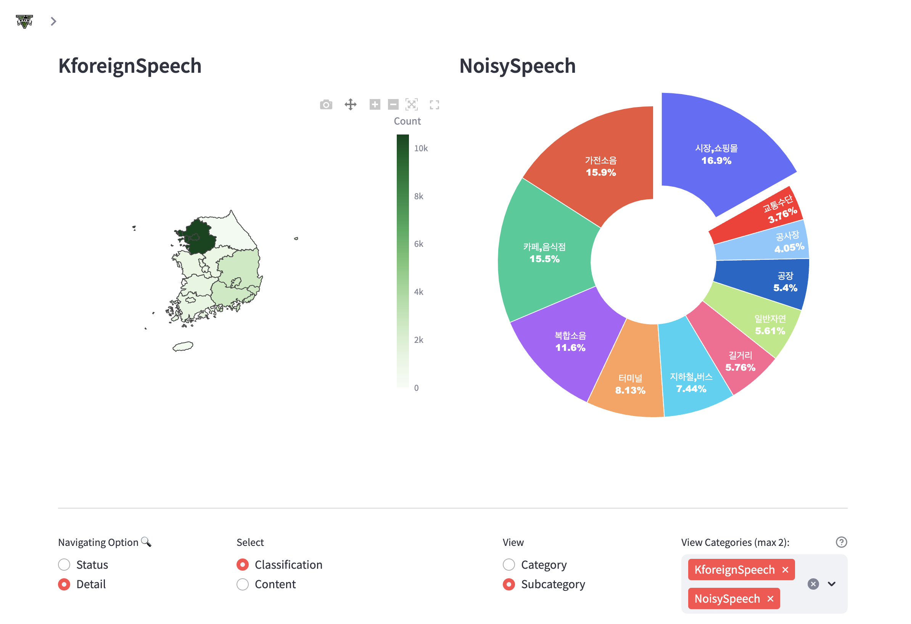
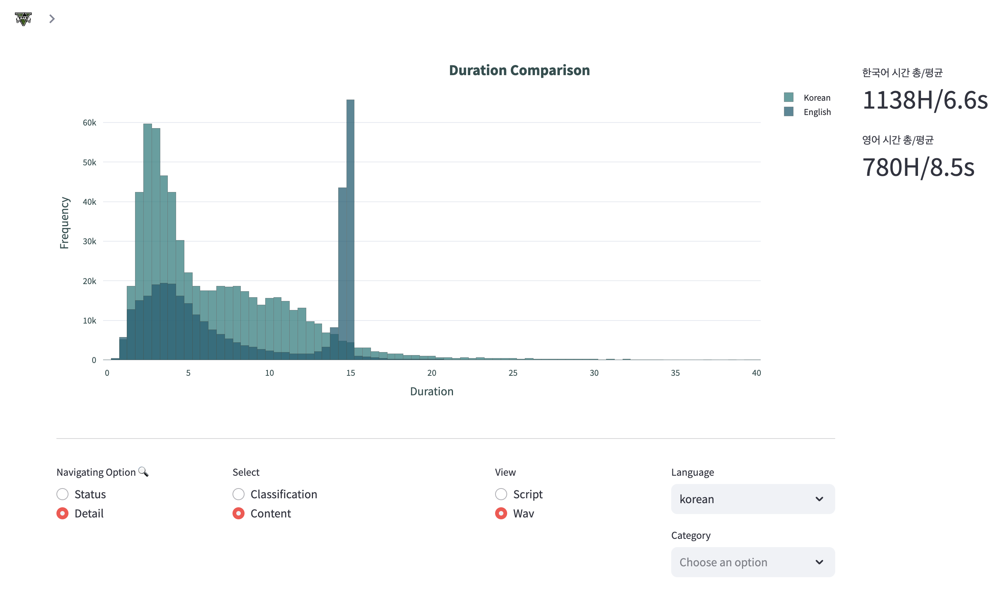
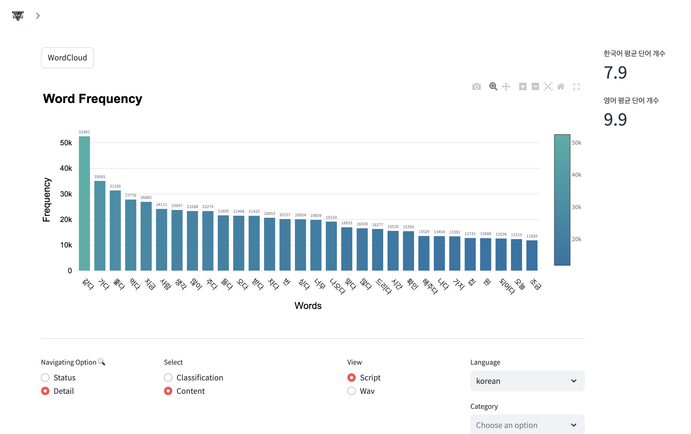
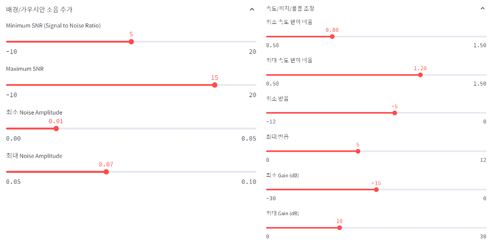
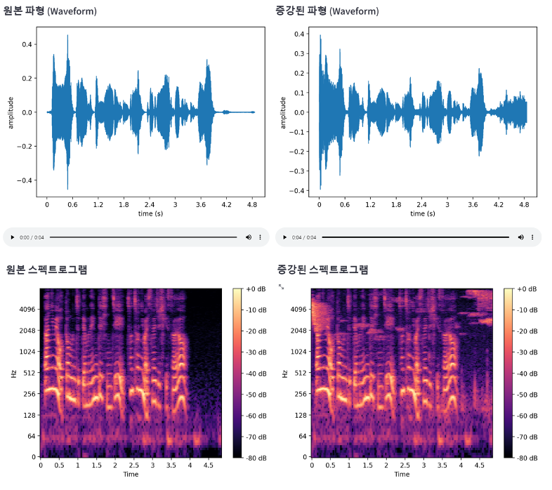

# Dashboard for visualization & augmentation

## Intro
This Dashboard aims to visualize the status and contents of the data in possesion using **Streamlit** framework and transform the audio data by **audiomentations** library. To leverage the strengths of Streamlit, the project maximizes **User Interactivity**.

## Webpage
[Dashboard web page](https://db-dashboard.streamlit.app/)

## Usage
```bash
pip install -r requirements.txt
apt-get install ffmpeg
streamlit run dashboard.py
```

## Function
### Data Navigator
1. **Status** : The pattern of data changes during selected dates

2. **Details/Category** : The category distribution of the dataset


3. **Details/Contents** : Duration/Script information of the dataset



### Augmentation
1. **Upload** : You can upload the audio file that you want to augment(transform).
2. **Record** : Or you can record it yourself.
3. **Batch Augmentation** : You can upload the audio file here and select the amount of augmented files you'd like. It will transform the audio into random, various ways.

## Augmentation Options
In the **Upload** and **Record** section, you can manually choose the specific options of transformation. The options consists of **Noise**, **Speed**, **Pitch**, and **Volume**.


Also after augmentation is processed, you can see how it has changed by **Waveform** and **Spectrogram**. 


